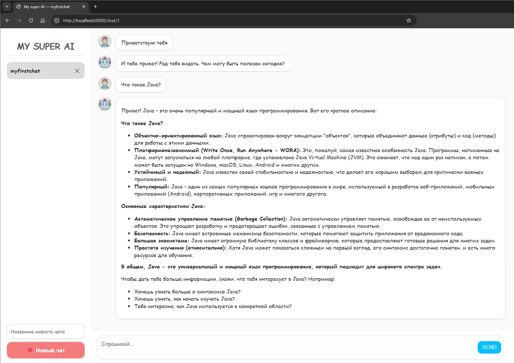

# 🧠  RAG Chat Application

Простое чат-приложение на Spring Boot с использованием PostgreSQL, Ollama LLM и Server-Sent Events для потоковой передачи ответов.

## 🌟 Возможности
- Сохранение истории чатов в PostgreSQL
- Поддержка векторной базы данных через pgvector
- Потоковая передача ответов с использованием SSE
- Интеграция с Ollama LLM (модель gemma3:4b-it-q4_K_M)

## 🚀 Запуск приложения

Склонировать репозиторий с кодом и перейти в корневую директорию проекта.

```bash
git clone https://github.com/alextim1508/my-ai
```

Собрать jar архив.

```bash
gradle bootJar
```

Запустить docker compose файл.

```bash
docker-compose -f docker-compose.yml up -d 
```

Приложение доступно по адресу `http://localhost:8088`

